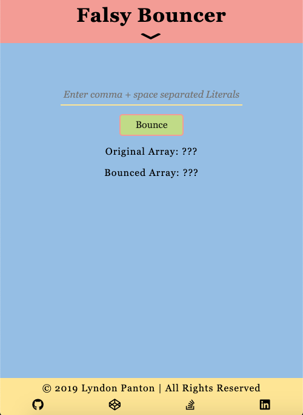
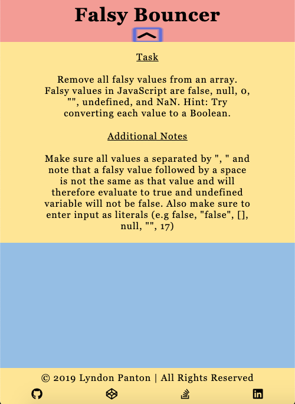
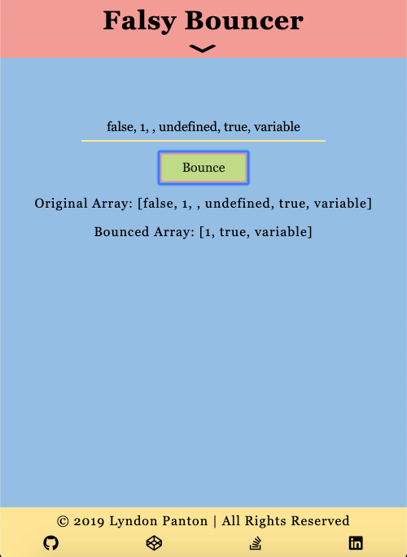

# Falsy Boucer

## How To Open
> 1. Go to the project's download folder
> 2. Right click on the file named _index.html_
> 3. Choose the _open with_ option
> 4. Open the project in your desired browser

## How To Use
> 1. Enter JavaScript literals separated by a comma followed by a space in the text input field
> 2. Click the _Bounce_ button
> 3. The origin values along with the values which have not been bounced will be displayed

## Requirements
> 1. This project requires a browser to run
> 2. The browser must have JavaScript available and enabled

## Extra Information
> 1. This was done for one of freecodecamp's Basic Algorithm Scripting activities

## Preview

